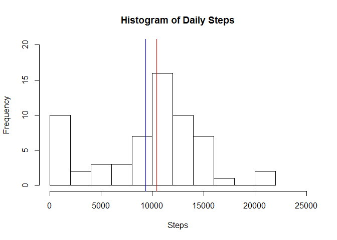
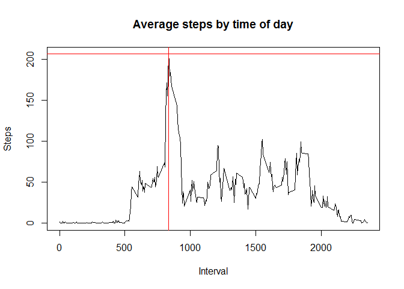
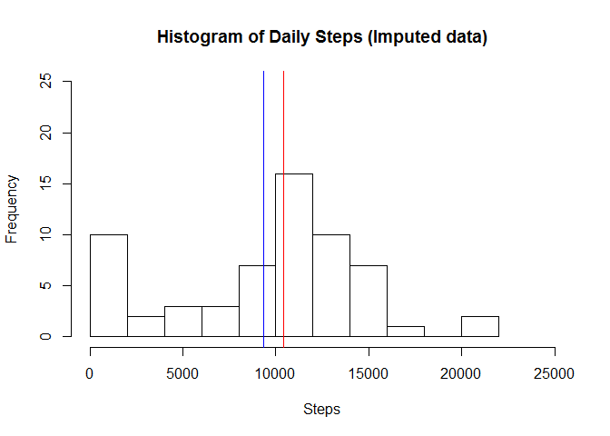
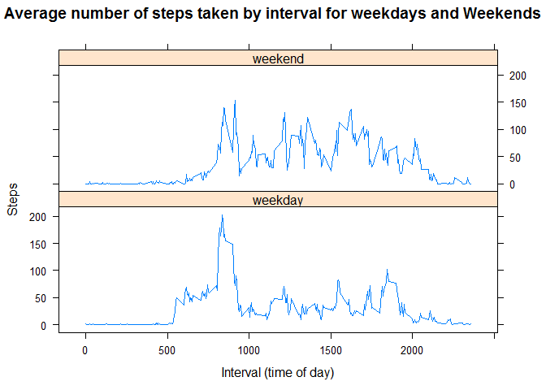

# Reproducible Research: Peer Assessment 1

## Introduction
It is now possible to collect a large amount of data about personal
movement using activity monitoring devices such as a
[Fitbit](http://www.fitbit.com), [Nike
Fuelband](http://www.nike.com/us/en_us/c/nikeplus-fuelband), or
[Jawbone Up](https://jawbone.com/up). These type of devices are part of
the "quantified self" movement -- a group of enthusiasts who take
measurements about themselves regularly to improve their health, to
find patterns in their behavior, or because they are tech geeks. But
these data remain under-utilized both because the raw data are hard to
obtain and there is a lack of statistical methods and software for
processing and interpreting the data.

This assignment makes use of data from a personal activity monitoring
device. This device collects data at 5 minute intervals through out the
day. The data consists of two months of data from an anonymous
individual collected during the months of October and November, 2012
and include the number of steps taken in 5 minute intervals each day.

## Data

The data for this assignment can be downloaded from the course web
site:

* Dataset: [Activity monitoring data](https://d396qusza40orc.cloudfront.net/repdata%2Fdata%2Factivity.zip) [52K]

The variables included in this dataset are:

* **steps**: Number of steps taking in a 5-minute interval (missing
    values are coded as `NA`)

* **date**: The date on which the measurement was taken in YYYY-MM-DD
    format

* **interval**: Identifier for the 5-minute interval in which
    measurement was taken


The dataset is stored in a comma-separated-value (CSV) file and there
are a total of 17,568 observations in this
dataset.


## Loading and preprocessing the data
Read the data directly from the zip file.

```r
data <- read.table(unz("activity.zip", "activity.csv"), header=T, quote="\"", sep=",")
```

This is what the data looks like:

```r
head(data)
```

```
##   steps       date interval
## 1    NA 2012-10-01        0
## 2    NA 2012-10-01        5
## 3    NA 2012-10-01       10
## 4    NA 2012-10-01       15
## 5    NA 2012-10-01       20
## 6    NA 2012-10-01       25
```

## What is mean total number of steps taken per day?
Calculate the total number of steps taken each day by aggregating by date. Ignore missing values.


```r
dailysum <- aggregate(x = data["steps"],
                     FUN = sum,
                     by = list(Group.date = data$date), na.rm=TRUE)
```


This is what the aggregated data looks like:

```r
head(dailysum)
```

```
##   Group.date steps
## 1 2012-10-01     0
## 2 2012-10-02   126
## 3 2012-10-03 11352
## 4 2012-10-04 12116
## 5 2012-10-05 13294
## 6 2012-10-06 15420
```

Plot a histogram of the total number of steps taken each day.


```r
hist(x=dailysum$steps, breaks=10, main="Histogram of Daily Steps", xlab="Steps", ylab="Frequency", xlim=c(0, 25000), ylim=c(0, 20))
meanDaily <- mean(dailysum[["steps"]])
medianDaily <- median(dailysum[["steps"]])
abline(v=meanDaily, col="blue")
abline(v=medianDaily, col="red")
```

 

The mean (blue vertical line) is: 9354.2295082

The median (red vertical line) is: 10395


## What is the average daily activity pattern?
Calculate the daily activity by aggregating by interval (time of day). Ignore missing values.


```r
dailyav <- aggregate(x = data["steps"],
                      FUN = mean,
                      by = list(Group.interval = data$interval), na.rm=TRUE)

maxrow <- dailyav[ dailyav$steps == max(dailyav$steps), ]
```


This is what the aggregated data looks like:

```r
head(dailyav)
```

```
##   Group.interval     steps
## 1              0 1.7169811
## 2              5 0.3396226
## 3             10 0.1320755
## 4             15 0.1509434
## 5             20 0.0754717
## 6             25 2.0943396
```

Plot the daily averaged steps by interval (time of day).


```r
plot(dailyav, type="l", xlab="Interval", ylab="Steps", main="Average steps by time of day")
abline(v=maxrow$Group.interval, col="red")
abline(h=maxrow$steps, col="red")
```

 

The interval with the maximum number of steps is: 835 with a value of 206.1698113.

## Imputing missing values

Calculate the number of values missing from the data.


```r
numMissingValues <- length(data$steps[is.na(data$steps)])
```

The number of missing values is: 2304.

Use the Hmisc package to impute the missing data.

Work on a copy of the original data.

Use the impute function to set the missing values to the median.


```r
library(Hmisc)
```


```r
newdata <- data
newdata$steps <- impute(newdata$steps, median)
```

This is what the imputed data looks like:

```r
head(newdata)
```

```
##   steps       date interval
## 1     0 2012-10-01        0
## 2     0 2012-10-01        5
## 3     0 2012-10-01       10
## 4     0 2012-10-01       15
## 5     0 2012-10-01       20
## 6     0 2012-10-01       25
```

Calculate the total number of steps taken each day by aggregating by date.


```r
newdailysum <- aggregate(x = newdata["steps"],
                     FUN = sum,
                     by = list(Group.date = newdata$date), na.rm=TRUE)
```


This is what the aggregated data looks like:

```r
head(newdailysum)
```

```
##   Group.date steps
## 1 2012-10-01     0
## 2 2012-10-02   126
## 3 2012-10-03 11352
## 4 2012-10-04 12116
## 5 2012-10-05 13294
## 6 2012-10-06 15420
```

Plot a histogram of the total number of steps taken each day.


```r
hist(x=newdailysum$steps, breaks=10, main="Histogram of Daily Steps (Imputed data)", xlab="Steps", ylab="Frequency", xlim=c(0, 25000), ylim=c(0, 25))
newmeanDaily <- mean(newdailysum[["steps"]])
newmedianDaily <- median(newdailysum[["steps"]])
abline(v=newmeanDaily, col="blue")
abline(v=newmedianDaily, col="red")
```

 

The imputed data mean is: 9354.2295082

The imputed data median is: 1.0395\times 10^{4}

The original mean is: 9354.2295082

The original median is: 10395


## Are there differences in activity patterns between weekdays and weekends?

Create a new function to determine if a date is a weekday or a weekend and then vectorize it.


```r
isweekend <- function(date) {
    if (weekdays(date) == "Saturday" | weekdays(date) == "Sunday")
        return("weekend")
    else
        return("weekday")
}

visweekend <- Vectorize(isweekend, "date")
```

Now mutate the new data set and add a new factor variable to it


```r
library(plyr)
```

```
## 
## Attaching package: 'plyr'
## 
## The following objects are masked from 'package:Hmisc':
## 
##     is.discrete, summarize
```

```r
newdata <- mutate(newdata, DayType = visweekend(as.Date(date)))
newdata$DayType <- as.factor(newdata$DayType)
```

The modified dataset looks like this:


```r
head(newdata)
```

```
##   steps       date interval DayType
## 1     0 2012-10-01        0 weekday
## 2     0 2012-10-01        5 weekday
## 3     0 2012-10-01       10 weekday
## 4     0 2012-10-01       15 weekday
## 5     0 2012-10-01       20 weekday
## 6     0 2012-10-01       25 weekday
```

Aggregate the data by interval for weekdays and weekends.


```r
newdailyav <- aggregate(steps ~ interval + DayType, newdata, mean)
```

The aggregated data looks like this:


```r
head(newdailyav)
```

```
##   interval DayType      steps
## 1        0 weekday 2.02222222
## 2        5 weekday 0.40000000
## 3       10 weekday 0.15555556
## 4       15 weekday 0.17777778
## 5       20 weekday 0.08888889
## 6       25 weekday 1.31111111
```

Use lattice to plot the data:


```r
library(lattice)
xyplot(steps ~ interval | DayType, newdailyav, type = "l", layout = c(1,2),
    main = "Average number of steps taken by interval for weekdays and Weekends",
    xlab = "Interval (time of day)", ylab = "Steps" )
```

 


